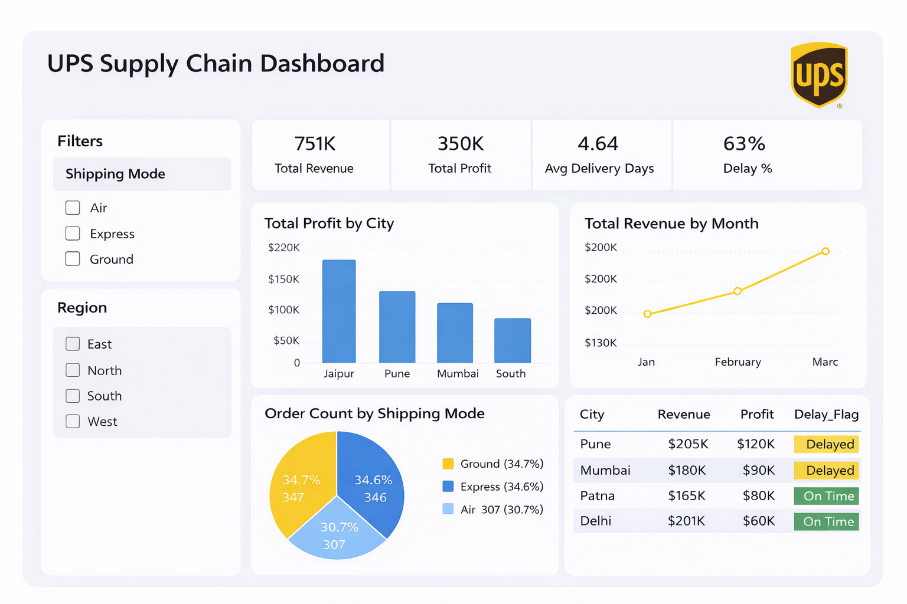

# UPS Supply Chain Performance Dashboard 🚚

## 🏆 Project Recognition
This project was awarded the **Spark of Brilliance** and **RNR Award** at UPS for providing strategic visibility into supply chain bottlenecks.

## 📊 Business Problem
The goal was to analyze shipping performance across different regions and modes of transport to identify where delays were impacting profitability.

## 🛠️ Technical Stack
- **Tool:** Power BI Desktop
- **Transformation:** Power Query (ETL & Data Cleaning)
- **Modeling:** DAX (Measures and Calculated Columns)

## 📈 Key Insights
- Identified a **63% overall delay rate**, highlighting a critical area for operational improvement.
- Discovered that **Jaipur** is the highest profit-contributing city.
- Tracked revenue trends showing a steady growth through Q1.

---
*Note: Due to corporate privacy policies, the original .pbix file is not hosted here. This repository serves as a case study of the logic and design implemented.*
